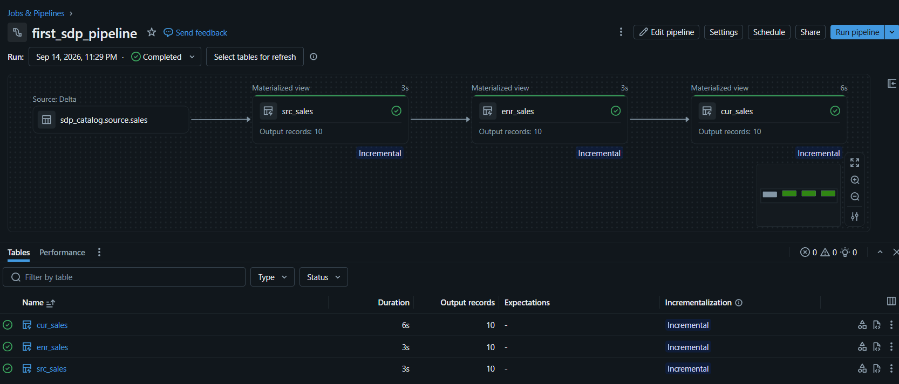
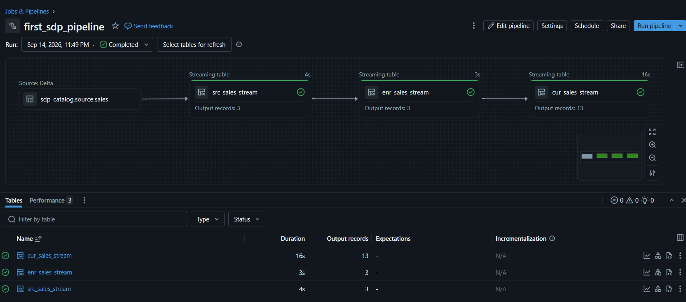
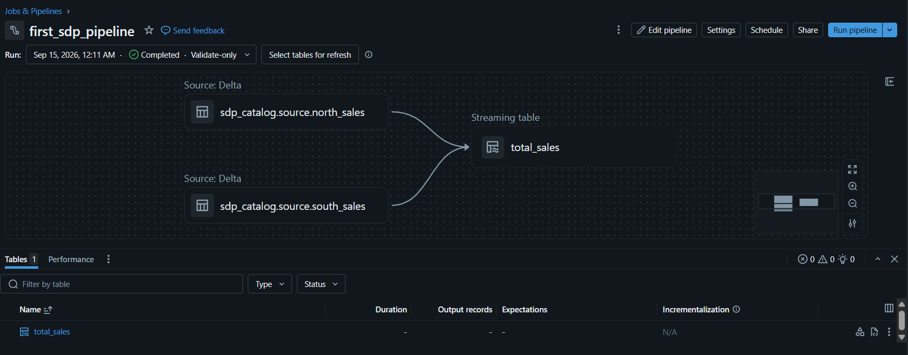
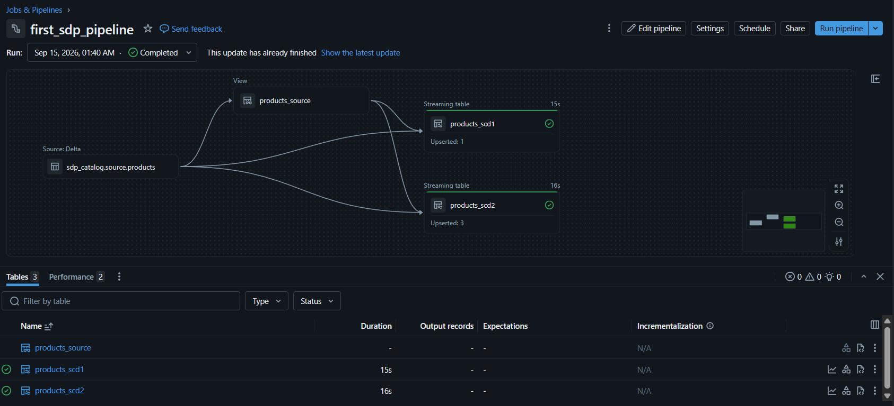
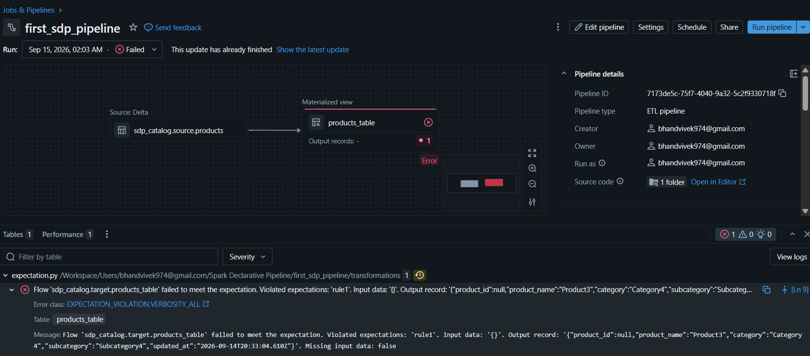
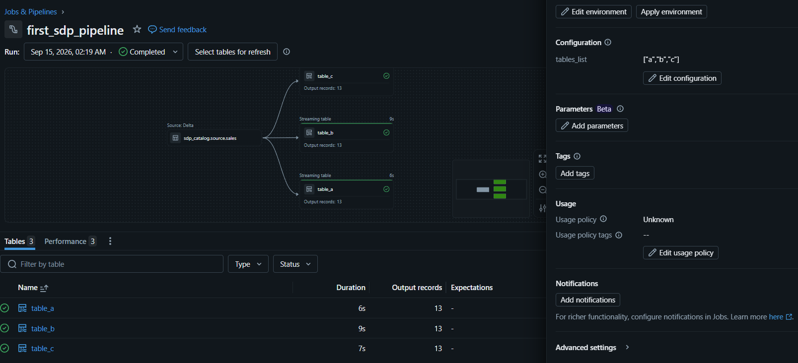

<div align="center">

# ⚡ Spark Declarative Pipelines (SDP) 

### Practical, working implementation of every core SDP pattern using `pyspark.pipelines`


</div>

---

## 📌 About This Repo

**Spark Declarative Pipelines (SDP)** is Apache Spark's built-in declarative ETL framework (`pyspark.pipelines`, Spark 4.1+). Instead of writing step-by-step imperative code that manually reads, transforms, writes, checkpoints, and orchestrates data, you simply **declare what tables should exist and what data they should contain** — SDP automatically figures out the dependency graph, execution order, incremental vs. full processing, and failure handling.

This repo is **not a copy-pasted tutorial** — it's my own hands-on practice environment where I deliberately built one working pipeline per core SDP capability, so that I could learn each concept by actually shipping it, not just reading about it. Every file below runs, was debugged by me, and maps to a distinct real-world data engineering problem.

> **The core idea driving this repo:** every pipeline here answers the question *"what production problem does this SDP feature actually solve, and what does that look like in real code?"* — not just *"what's the syntax?"*

---

## 🗂️ Repo Structure

| File | Pattern Demonstrated | Real-world problem it solves |
|---|---|---|
| [`first_dag.py`](./first_dag.py) | Batch pipeline using **Materialized Views** | Daily/reporting-style aggregation (Bronze → Silver → Gold) |
| [`second_dag.py`](./second_dag.py) | Same logic rebuilt as a **Streaming Tables** pipeline | Low-latency, continuously-updating version of the same reports |
| [`append_flow.py`](./append_flow.py) | **Multi-source fan-in** into one table | Combining regional/per-store feeds without a manual `UNION` |
| [`auto_cdc.py`](./auto_cdc.py) | **AUTO CDC** — declarative SCD Type 1 & Type 2 | Replicating an OLTP table's changes without hand-written `MERGE INTO` |
| [`expectation.py`](./expectation.py) | **Data quality gates** (`expect_all_or_fail`) | Stopping bad data before it reaches CDC / downstream consumers |
| [`parameters.py`](./parameters.py) | **Config-driven, dynamic pipeline generation** | Scaling the number of output tables without touching code |
| [`utils/`](./utils) | Pipeline-run screenshots — one per file, same name (e.g. `utils/first_dag.png`) | Visual proof each pipeline actually ran successfully |

---

## 🧩 Core SDP Concepts — Quick Glossary

If you're new to SDP, here's the minimum context needed to follow the code below:

| Concept | What it means |
|---|---|
| **Flow** | The atomic unit: read → transform → write into a target table. Every function below *is* a flow. |
| **Materialized View** | A table backed by exactly one **batch** flow. Always recomputed to be *correct*, even if source rows are updated/deleted — ideal for joins/aggregations. |
| **Streaming Table** | A table backed by one or more **streaming** flows. Processes each new row exactly once, incrementally — ideal for append-only, high-volume ingestion. |
| **Temporary View** | A view scoped to the pipeline run only — used to share reusable logic between flows without materializing it as a physical table. |
| **Pipeline** | The full collection of flows/datasets; SDP auto-builds the dependency graph purely from which tables each flow's code references. |

---

## ✅ SDP Capabilities Implemented

- [x] Materialized Views — chained across 3 stages, dependency-resolved automatically (no manual DAG)
- [x] Streaming Tables — exactly-once, incremental equivalents of the same business logic
- [x] Temporary Views — used as a shared, reusable source for multiple CDC targets
- [x] Append Flows — multiple independent flows writing into a single target table
- [x] AUTO CDC — both **SCD Type 1** (overwrite/latest-state) and **SCD Type 2** (full history)
- [x] Expectations — grouped data-quality rules enforced at `fail` severity
- [x] Pipeline Parameters — Python-side `spark.conf.get()` driving dynamic table creation in a loop
- [x] Zero manual orchestration code anywhere in this repo — every dependency graph is auto-derived

---

## 🔍 Walkthrough — Each Pipeline in Depth

### 1️⃣ Batch Pipeline — `first_dag.py`

**Why this pattern:** most reporting/analytics tables don't need sub-second freshness — they need to be *correct*. Materialized views recompute (fully or incrementally, whichever is cheaper) so aggregations always reflect the true current state of the source, even if historical rows change.

Three chained materialized views implement a classic **Bronze → Silver → Gold** flow:
- `src_sales` — parses a raw string date column into a proper `DATE` type (Bronze/landing).
- `enr_sales` — applies a business rule, a 1.5x markup on revenue (Silver/enriched).
- `cur_sales` — aggregates total revenue per day (Gold/curated, reporting-ready).

```python
@dp.materialized_view(name="src_sales")
def src_sales():
    df = spark.read.table("sdp_catalog.source.sales")
    return df.withColumn("sale_date", to_date(col("date"), "MM-dd-yyyy"))

@dp.materialized_view(name="cur_sales")
def cur_sales():
    df = spark.read.table("sdp_catalog.target.enr_sales")
    return df.groupBy("date").agg(sum("revenue").alias("total_sales"))
```

**Key takeaway:** I never wrote a single line of orchestration code. SDP detected that `enr_sales` reads from `src_sales`, and `cur_sales` reads from `enr_sales`, purely by parsing the table names referenced inside each function — and built the execution order from that automatically.



---

### 2️⃣ Streaming Pipeline — `second_dag.py`

**Why this pattern:** the exact same business question ("what's total revenue per day?") sometimes needs to be answered continuously rather than on a schedule — e.g., a live operations dashboard. Rebuilding `first_dag.py` with streaming reads shows I understand these aren't two different tools, but **two settings of the same abstraction**.

```python
@dp.table(name="src_sales_stream")
def src_sales():
    df = spark.readStream.table("sdp_catalog.source.sales")
    return df.withColumn("sale_date", to_date(col("date"), "MM-dd-yyyy"))

@dp.table(name="cur_sales_stream")
def cur_sales():
    df = spark.readStream.table("sdp_catalog.target.enr_sales_stream")
    return df.groupBy("date").agg(sum("revenue").alias("total_sales"))
```

**Key takeaway:** swapping `spark.read` → `spark.readStream` and `@dp.materialized_view` → `@dp.table` is the *entire* code difference — but the operational meaning is huge: this version processes only new rows as they land, with SDP managing checkpoints/state automatically instead of me hand-writing watermark or offset-tracking logic.



---

### 3️⃣ Multi-Source Fan-in — `append_flow.py`

**Why this pattern:** real pipelines often need to combine several independent, differently-paced source feeds (e.g., a north-region store system and a south-region store system) into one unified table — without one feed's failure or lag affecting the other.

```python
dp.create_streaming_table("total_sales")  # empty target shell first

@dp.append_flow(target="total_sales")
def north_sales():
    return spark.readStream.table("sdp_catalog.source.north_sales")

@dp.append_flow(target="total_sales")
def south_sales():
    return spark.readStream.table("sdp_catalog.source.south_sales")
```

**Key takeaway:** each `@dp.append_flow` is checkpointed and retried **independently** — if the south-region feed goes down, the north-region flow keeps running unaffected, and both still land in the same `total_sales` table. This is a cleaner and safer alternative to manually `union()`-ing two DataFrames in one function.



---

### 4️⃣ Declarative CDC — `auto_cdc.py`

**Why this pattern:** replicating changes from an operational source (inserts/updates/deletes) traditionally means writing complex `MERGE INTO` SQL that has to correctly handle out-of-order events, deduplication, and whether you want history or just the latest state. `AUTO CDC` turns all of that into a declarative call.

```python
dp.create_streaming_table("products_scd2")
dp.create_streaming_table("products_scd1")

@dp.temporary_view
def products_source():
    return spark.readStream.table("sdp_catalog.source.products")

# Full history of every change, per product_id
dp.create_auto_cdc_flow(
    target="products_scd2", source="products_source",
    keys=["product_id"], sequence_by=col("updated_at"),
    except_column_list=["updated_at"], stored_as_scd_type="2"
)

# Only the latest state, per product_id
dp.create_auto_cdc_flow(
    target="products_scd1", source="products_source",
    keys=["product_id"], sequence_by=col("updated_at"),
    except_column_list=["updated_at"], stored_as_scd_type="1"
)
```

**Key takeaway:** one shared `products_source` temporary view feeds **two different SCD targets** — an SCD Type 1 table for "current state" reporting, and an SCD Type 2 table (with auto-managed `__START_AT`/`__END_AT` columns) for full audit/point-in-time history. The `sequence_by=col("updated_at")` parameter is what guarantees correctness even if change events physically arrive out of order — I don't write that ordering logic myself.



---

### 5️⃣ Data Quality Gate — `expectation.py`

**Why this pattern:** a pipeline is only as trustworthy as the data flowing through it. Rather than validating data in a separate ad-hoc script, SDP lets you attach validation rules **directly to the table definition**, so quality is enforced every single run, automatically.

```python
rules = {
    "rule1": "product_id IS NOT NULL",
    "rule2": "updated_at IS NOT NULL",
}

@dp.table(name="products_table")
@dp.expect_all_or_fail(rules)
def products_table():
    return spark.read.table("sdp_catalog.source.products")
```

**Key takeaway:** I deliberately chose the strictest action (`expect_all_or_fail`, not `warn` or `drop`) because both `product_id` and `updated_at` are structural columns the CDC pipeline above (`auto_cdc.py`) depends on — `product_id` as the CDC key, `updated_at` as the CDC sequencing column. If either is null, the whole update fails loudly and atomically instead of silently corrupting downstream CDC results.



---

### 6️⃣ Config-Driven, Dynamic Pipelines — `parameters.py`

**Why this pattern:** sometimes the *number* of tables a pipeline should produce is itself a variable — e.g., one table per business unit, region, or client — and you don't want to edit code every time that list changes.

```python
import ast
from pyspark import pipelines as dp

list_var = spark.conf.get("tables_list")           # read pipeline Configuration value
list_var_list = ast.literal_eval(list_var)          # safely parse the string into a real list

for i in list_var_list:
    @dp.table(name=f"table_{i}")
    def table():
        return spark.readStream.table("sdp_catalog.source.sales")
```

**Key takeaway:** the entire set of output tables is controlled by a single external configuration value (`tables_list`), read at runtime with `spark.conf.get()` — not by editing this file. I used `ast.literal_eval` instead of `eval` specifically because pipeline configuration is external input, and `literal_eval` can only parse literal data structures, never execute arbitrary code — a small but deliberate security-conscious choice.



---

## 🗺️ How the Pieces Connect

```
sdp_catalog.source.sales
   ├── first_dag.py   → src_sales(MV) → enr_sales(MV) → cur_sales(MV)      [batch]
   └── second_dag.py  → src_sales_stream(ST) → enr_sales_stream(ST) → cur_sales_stream(ST)  [streaming]

sdp_catalog.source.north_sales ┐
                                 ├── append_flow.py → total_sales (fan-in streaming table)
sdp_catalog.source.south_sales ┘

sdp_catalog.source.products
   └── expectation.py  → products_table (validated Bronze layer, fail-fast on bad keys)
   └── auto_cdc.py      → products_source (temp view)
                             ├── SCD Type 2 → products_scd2 (full history)
                             └── SCD Type 1 → products_scd1 (latest state)

parameters.py → reads "tables_list" config → dynamically creates table_a, table_b, table_c ...
```

---

## 🧠 What I Learned

- **Dependency resolution is purely textual, not magical** — SDP looks at which table names your function's code references and builds the DAG from that. This means *how* you name and structure reads directly determines your pipeline's execution graph.
- **Materialized view vs. streaming table is an architectural decision, not a syntax choice** — it comes down to whether your source is append-only vs. updatable, and whether you need "always correct after recompute" vs. "fast, incremental, exactly-once."
- **AUTO CDC collapses a lot of hard-won `MERGE INTO` expertise into a few declarative parameters** (`keys`, `sequence_by`, `stored_as_scd_type`) — but you still need to understand *why* those parameters exist (ordering, dedup, history) to configure them correctly.
- **Data quality as configuration, not as a side script** — expectations live in the same file as the transformation, which means quality rules can't silently drift out of sync with the pipeline logic like a separate validation script can.
- **Choosing `warn` / `drop` / `fail` is itself a design decision**, driven by how critical a column is to downstream consumers — I chose `fail` specifically because my CDC pipeline structurally depends on the columns being validated.
- **Parameterizing Python pipeline code goes through `spark.conf.get()`**, not the SQL-only `${param}` syntax — a subtlety that only becomes obvious once you actually try to make Python-based pipeline code reusable across environments.
- **Every pattern in this repo composes with the others** — the same `products_source` view feeds two CDC targets, and the expectation-gated `products_table` protects exactly the columns those CDC flows rely on. Building these together (not in isolation) is what made the trade-offs actually click.

---

## 🛠️ Tech Stack

`Apache Spark 4.1+` · `PySpark (pyspark.pipelines)` · `Delta Lake` · `Databricks Lakeflow` · `Structured Streaming` · `SQL`

---

## 📖 References

- [Spark Declarative Pipelines — Official Programming Guide](https://spark.apache.org/docs/latest/declarative-pipelines-programming-guide.html)
- [Azure Databricks — Lakeflow Declarative Pipelines Docs](https://learn.microsoft.com/en-us/azure/databricks/)

---

<div align="center">

*Built to learn by doing — every file in this repo runs, and every pattern was implemented end-to-end, not just read about.*

</div>
